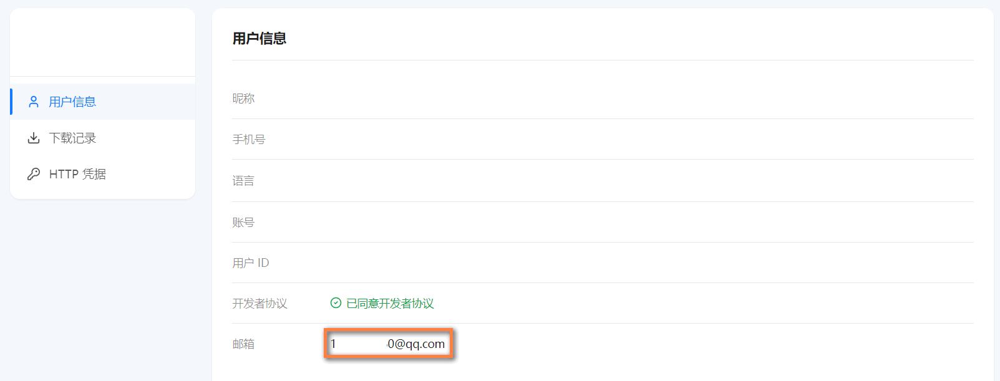
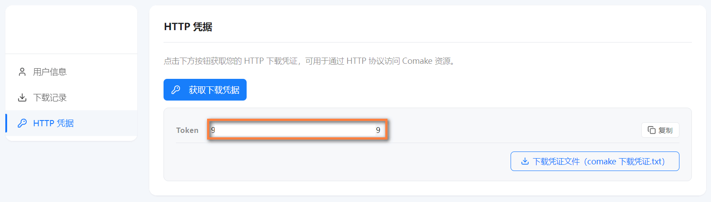
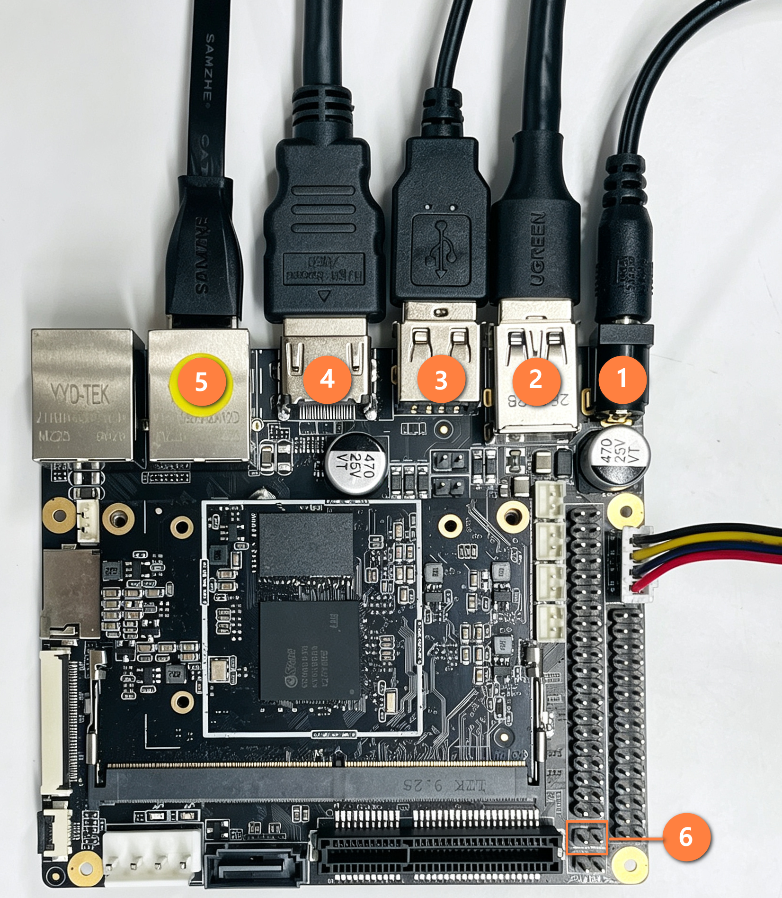
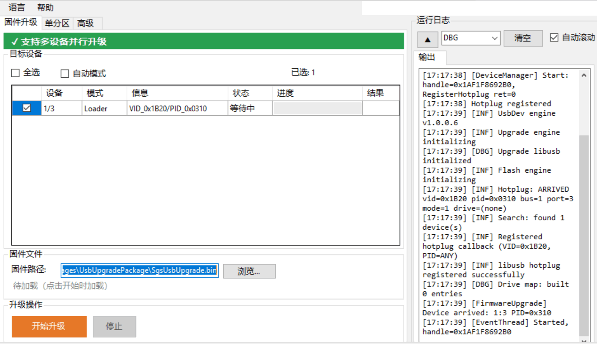
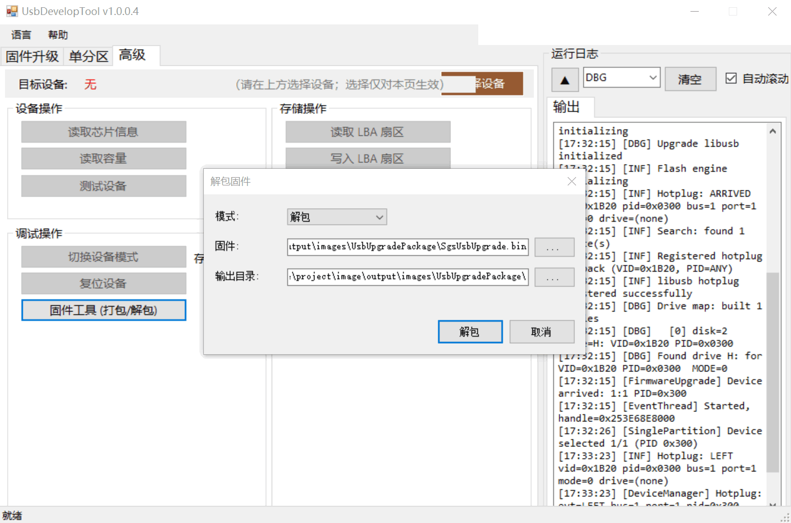
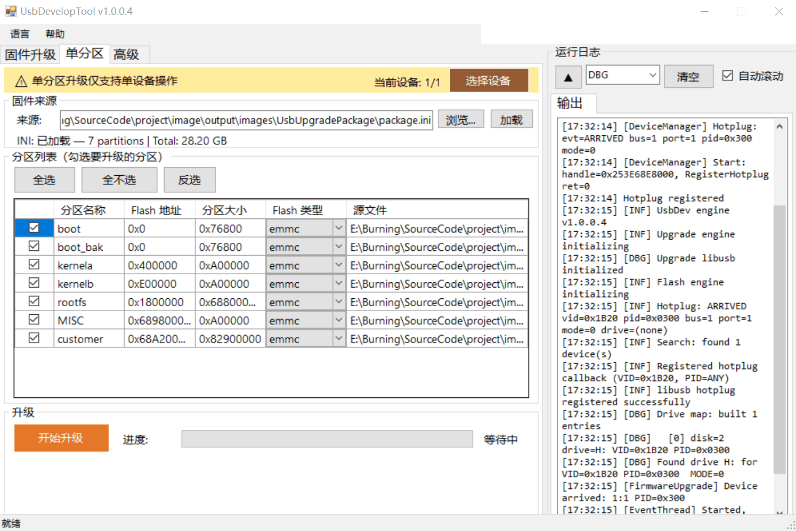
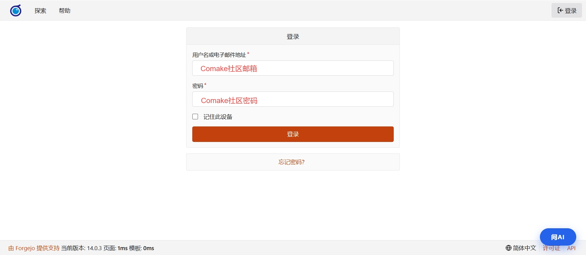
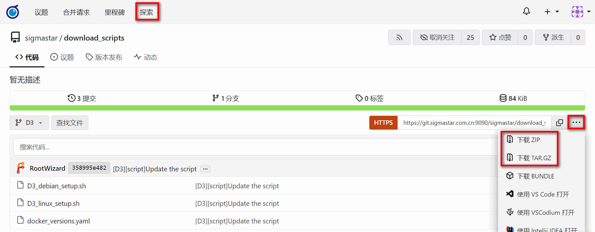
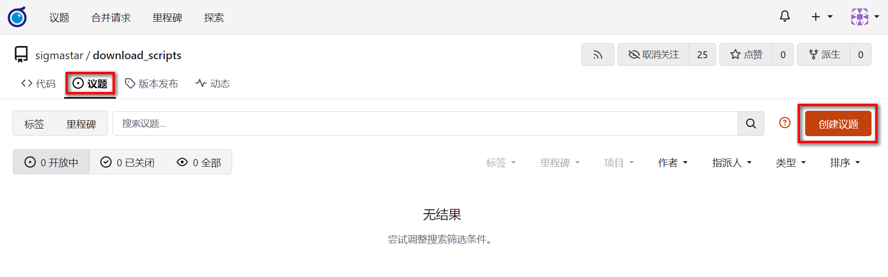
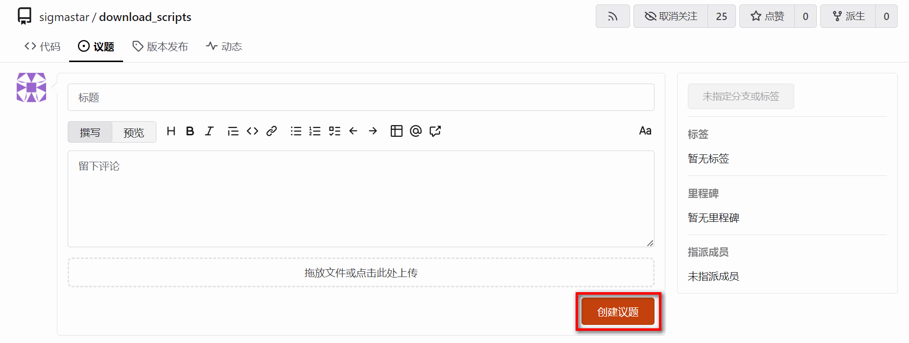

# Comake Pi D3 快速上手指南

## 1. 平台简介

### 1.1 Comake

[Comake](https://www.comake.online) 是一站式端边侧 AI 开发服务平台，提供从选型到量产的全链路支持。"Comake Pi" 是 Comake 自研的物理 AI 开发板系列，覆盖从轻智能 AIoT（1T 算力）到视频边缘计算（8T 算力）的场景需求。

### 1.2 Git Web

[Git Web](https://git.sigmastar.com.cn:9090/user/login) 是 Sigmastar 对外提供的代码托管平台。

**平台定位**：

- **代码分发**：对外发布 SDK、示例代码、工具等，供用户下载使用
- **议题反馈**：用户可通过议题功能提交问题、建议或技术咨询

**账号体系**：

[Git Web](https://git.sigmastar.com.cn:9090/user/login) 平台的账号与 Sigmastar Comake 社区（`https://www.comake.online`）打通，用户需先注册 Comake 社区账号后方可登录 Git Web。

> **注意**：本平台为对外只读平台，**不支持用户创建个人仓库或直接提交代码**。

### 1.3 Comake Pi D3

Comake Pi D3 是一块 **面向端边侧 AI 应用的视频边缘计算开发板**。其核心计算模块搭载 SigmaStar SCM8003G 主控芯片，采用 260-Pin SO-DIMM 金手指标准封装。核心规格如下：

| 项目 | 规格 |
|------|------|
| SoC | SCM8003G，6 核 ARM Cortex-A55，最高 1.8GHz |
| AI 引擎 | 8 TOPS IPU（支持 INT4/8/16、FP16/BF16） |
| 视频分析 | IVE 智能视频引擎（30+ 算子） |
| 安全引擎 | AES/RSA/SM2~4 国密、Secure Boot、TrustZone |
| 内存 | LPDDR4X，2GB / 4GB（可选配置），最高 3200 Mbps |
| 存储 | 64GB eMMC 5.0 |
| 视频解码 | H.264/H.265，最大 2 路 8K@30fps；JPEG 4K@25fps × 2 |
| 视频编码 | H.264 1080P@30fps；JPEG 4K@30fps |
| 显示 | HDMI 4K@30 + MIPI DSI 2560×1600@60 + VGA 1920×1200@60，支持双屏异显 |
| 音频 | 立体声 ADC + DAC；I2S 8 通道 + DMIC 8 通道 |
| 网络 | 双路千兆网（底板需外接 PHY） |
| USB | 1× USB 3.0 DRD + 4× USB 2.0 |
| PCIe | 双路 PCIe 2.0，每路 2-Lane，5 GT/s |
| SATA | 双路 SATA 3.0，6 Gbps |
| 尺寸 | 70.0mm × 45.0mm，典型功耗 ≤ 7W |

#### 1.3.1 开发板接口


---

## 2. 准备工作

### 2.1 安装 Docker

**Step 1: 安装依赖**

    sudo apt-get update && sudo apt-get install -y qemu-user-static binfmt-support docker.io

**Step 2: 验证 aarch64 跨架构支持**

    update-binfmts --display | grep "aarch64"

预期输出：

    qemu-aarch64 (enabled):
     interpreter = /usr/libexec/qemu-binfmt/aarch64-binfmt-P

若未启用，执行：

    sudo update-binfmts --enable

**Step 3: 配置 Docker 用户权限（root 用户可跳过）**

将当前用户加入 `docker` 用户组，避免每次执行 `docker` 命令都需要 `sudo`：

    sudo usermod -aG docker $USER

> **注意**：执行上述命令后，需重新登录或执行 `newgrp docker` 使配置生效。

### 2.2 获取 Git 下载凭证

在 [Comake 社区](https://www.comake.online)注册账号后，访问 [Comake 用户中心](https://www.comake.online/account)，记录以下信息以便进行 Git 认证：

- 邮箱：注册 Comake 账号时用到的邮箱

    

- Token：在 “HTTP 凭据” 界面点击 “获取下载凭证” 按钮生成

    

### 2.3 配置 Git 环境

1. 将 Git 下载凭证写入本地 `.netrc` 文件（让 Git 自动使用凭据进行认证，无需每次手动输入用户名和密码）：

        echo "machine git.sigmastar.com.cn login <邮箱> password <Token>" >> ~/.netrc
        chmod 600 ~/.netrc

2. 安装 `repo` 多仓库管理工具（下载脚本会通过它拉取 SDK 源码）：

        sudo wget https://mirrors.tuna.tsinghua.edu.cn/git/git-repo -O /usr/bin/repo
        sudo chmod a+x /usr/bin/repo

3. 设置 Git 全局用户名和邮箱：

        git config --global user.name "你的用户名"
        git config --global user.email "你的邮箱@example.com"

---

## 3. 下载 SDK

### 3.1 克隆下载脚本

```bash
git clone https://git.sigmastar.com.cn:9090/sigmastar/download_scripts.git
cd download_scripts
```

### 3.2 Debian SDK（推荐新手）

Debian SDK 提供完整的 Ubuntu 桌面体验，适合新手入门、桌面交互和多媒体播放场景。

**快速上手：**

```bash
# 一键下载所有资源（Docker 镜像、工具链、SDK、工具集等）
bash D3_debian_setup.sh all
```

执行 `all` 后的目录结构：

```
.
├── D3_debian_setup.sh
├── docker_versions.yaml
├── docs/                # 文档
├── hw_ref_design/       # 硬件参考设计
├── sgs_model_zoo/       # 算法模型库
├── SourceCode/          # SDK 源码（详见第 4 章）
│   ├── boot/
│   ├── kernel/
│   ├── optee/
│   ├── project/
│   └── sdk/
└── tools/               # SDK 工具集
    ├── BWLATool/
    ├── CalibrationTool/
    ├── FlashTool/
    ├── GenScalerTbl/
    ├── MakeBin/
    ├── PQTool/
    ├── SystemTool/
    ├── ToolChain/        # 交叉编译工具链
    ├── UsbDevelopTool/
    └── ...
```

**命令速查表：**

| 命令 | 说明 |
|------|------|
| `bash D3_debian_setup.sh all` | 一键下载最新版本全部资源 |
| `bash D3_debian_setup.sh all <version>` | 一键下载指定版本全部资源 |
| `bash D3_debian_setup.sh docker` | 下载最新版本 Docker 镜像 |
| `bash D3_debian_setup.sh docker <version>` | 下载指定版本 Docker 镜像 |
| `bash D3_debian_setup.sh sdk_toolchains` | 下载交叉编译工具链 |
| `bash D3_debian_setup.sh sdk` | 下载最新版本 SDK 源码 |
| `bash D3_debian_setup.sh sdk <version>` | 下载指定版本 SDK 源码 |
| `bash D3_debian_setup.sh tools` | 下载全部工具 |
| `bash D3_debian_setup.sh tools <tool_name>` | 下载单个工具 |
| `bash D3_debian_setup.sh model_zoo` | 下载最新版本算法模型库 |
| `bash D3_debian_setup.sh model_zoo <version>` | 下载指定版本算法模型库 |
| `bash D3_debian_setup.sh docs` | 下载最新版本文档 |
| `bash D3_debian_setup.sh docs <version>` | 下载指定版本文档 |
| `bash D3_debian_setup.sh hw_ref_design` | 下载硬件参考设计资料 |
| `bash D3_debian_setup.sh list_version` | 查看可用版本号 |
| `bash D3_debian_setup.sh list_tools` | 查看可用工具列表 |
| `bash D3_debian_setup.sh build_rootfs` | 构建最新版本 Ubuntu 根文件系统 |
| `bash D3_debian_setup.sh build_rootfs <version>` | 构建指定版本 Ubuntu 根文件系统 |
| `bash D3_debian_setup.sh build_image` | 编译最新版本系统镜像 |
| `bash D3_debian_setup.sh build_image <version>` | 编译指定版本系统镜像 |

### 3.3 Linux SDK

Linux SDK 提供精简的 64-bit Linux 系统（无桌面），适合产品化部署、资源受限或不需要图形界面的场景。Linux SDK 还支持直接下载预编译的固件镜像，无需本地编译。

**快速上手：**

```bash
# 一键下载所有资源（Docker 镜像、工具链、SDK、工具集等）
bash D3_linux_setup.sh all
```

执行 `all` 后的目录结构：

```
.
├── D3_linux_setup.sh
├── docker_versions.yaml
├── docs/                # 文档
├── hw_ref_design/       # 硬件参考设计
├── image/               # 预编译固件镜像（images.tar.gz）
├── sgs_model_zoo/       # 算法模型库
├── SourceCode/          # SDK 源码（详见第 4 章）
│   ├── boot/
│   ├── kernel/
│   ├── optee/
│   ├── project/
│   └── sdk/
└── tools/               # SDK 工具集
    ├── BWLATool/
    ├── CalibrationTool/
    ├── FlashTool/
    ├── GenScalerTbl/
    ├── MakeBin/
    ├── PQTool/
    ├── SystemTool/
    ├── ToolChain/        # 交叉编译工具链
    ├── UsbDevelopTool/
    └── ...
```

**命令速查表：**

| 命令 | 说明 |
|------|------|
| `bash D3_linux_setup.sh all` | 一键下载最新版本全部资源 |
| `bash D3_linux_setup.sh all <version>` | 一键下载指定版本全部资源 |
| `bash D3_linux_setup.sh docker` | 下载最新版本 Docker 镜像 |
| `bash D3_linux_setup.sh docker <version>` | 下载指定版本 Docker 镜像 |
| `bash D3_linux_setup.sh sdk_toolchains` | 下载交叉编译工具链 |
| `bash D3_linux_setup.sh sdk` | 下载最新版本 SDK 源码 |
| `bash D3_linux_setup.sh sdk <version>` | 下载指定版本 SDK 源码 |
| `bash D3_linux_setup.sh image` | 下载最新版本烧录固件 |
| `bash D3_linux_setup.sh image <version>` | 下载指定版本烧录固件 |
| `bash D3_linux_setup.sh tools` | 下载全部工具 |
| `bash D3_linux_setup.sh tools <tool_name>` | 下载单个工具 |
| `bash D3_linux_setup.sh model_zoo` | 下载最新版本算法模型库 |
| `bash D3_linux_setup.sh model_zoo <version>` | 下载指定版本算法模型库 |
| `bash D3_linux_setup.sh docs` | 下载最新版本文档 |
| `bash D3_linux_setup.sh docs <version>` | 下载指定版本文档 |
| `bash D3_linux_setup.sh hw_ref_design` | 下载硬件参考设计资料 |
| `bash D3_linux_setup.sh list_version` | 查看可用版本号 |
| `bash D3_linux_setup.sh list_tools` | 查看可用工具列表 |
| `bash D3_linux_setup.sh build_image` | 编译最新版本系统镜像 |
| `bash D3_linux_setup.sh build_image <version>` | 编译指定版本系统镜像 |

> **与 Debian SDK 的主要差异：** Linux SDK 多了 `image` 命令可直接下载预编译固件镜像，无需本地编译。

---

## 4. SDK 目录结构

下载完成后的 `SourceCode/` 目录结构如下：

```
SourceCode/
├── boot/                # U-Boot 引导程序
│   ├── arch/            #   架构相关代码（ARM）
│   ├── board/           #   板级支持（SigmaStar 平台）
│   ├── cmd/             #   U-Boot 命令实现
│   ├── configs/         #   板级默认配置文件
│   ├── drivers/         #   外设驱动（USB、MMC、NET 等）
│   ├── dts/             #   设备树源文件
│   ├── include/         #   头文件
│   ├── tools/           #   辅助工具
│   └── Makefile         #   U-Boot 编译入口
│
├── kernel/              # Linux 内核
│   ├── arch/arm64/      #   ARM64 架构代码（设备树在此）
│   ├── drivers/         #   内核驱动
│   ├── include/         #   内核头文件
│   ├── net/             #   网络协议栈
│   ├── sound/           #   音频子系统
│   └── Makefile         #   内核编译入口
│
├── project/             # 编译工程入口
│   ├── board/           #   板级配置
│   ├── configs/         #   defconfig 配置文件
│   ├── image/           #   镜像打包脚本与输出
│   ├── kbuild/          #   内核编译集成
│   ├── release/         #   发布输出
│   ├── tools/           #   工程辅助工具
│   └── makefile         #   顶层 Makefile（编译入口）
│
├── sdk/                 # 核心媒体 SDK
│   ├── driver/          #   多媒体驱动
│   ├── linux/           #   用户空间库
│   ├── vendor/          #   第三方组件（ffmpeg、gstreamer 等）
│   └── verify/          #   示例代码与测试程序
│       └── sample_code/ #   demo 代码（LLM/VLM、DLA 等）
│
└── optee/               # OP-TEE 安全执行环境
    ├── optee_os/        #   可信 OS 内核
    ├── optee_client/    #   客户端库
    ├── optee_examples/  #   示例 TA 应用
    └── optee_test/      #   测试套件
```

---

## 5. 编译固件

下载完成后，使用脚本一键编译：

### 5.1 Debian SDK

```bash
# 构建 Ubuntu 根文件系统
bash D3_debian_setup.sh build_rootfs

# 编译 64-bit Ubuntu 系统镜像
bash D3_debian_setup.sh build_image
```

其中 `SourceCode/project/image/output/images/UsbUpgradePackage` 目录生成的 `SgsUsbUpgrade.bin` 为 USB 升级固件，升级方法详见[固件升级](#Upgrade)。

### 5.2 Linux SDK

```bash
# 编译 64-bit Linux 系统镜像
bash D3_linux_setup.sh build_image
```

其中 `SourceCode/project/image/output/images/UsbUpgradePackage` 目录生成的 `SgsUsbUpgrade.bin` 为 USB 升级固件，升级方法详见[固件升级](#Upgrade)。

---

## 6. 固件升级 <a id="Upgrade"></a>

### 6.1 硬件接线



1. 开发板 CONV1 12V DC 电源接口接入 DC 12V 电源适配器。
2. 将双公头 USB 数据线一端接入开发板 CONU8 USB2.0 接口（黑色），另一端接入 PC。
3. 开发板任意 CON11 USB2.0 接口接入鼠标。
4. 将 HDMI 数据线一端接入开发板 CONH1 HDMI 接口，另一端接入显示屏。
5. 开发板 CONG1 RJ45 GE0 网口接入网线，确保开发板与 PC 连接至同一网段。

### 6.2 进入 USB 升级模式

根据 eMMC 当前状态，选择对应方式让开发板进入 USB 升级模式：

- **空片升级**：eMMC 处于出厂空白状态，或 U-Boot 等固件已被完全擦除。默认处于USB升级模式，直接插入USB线至CONU8 USB3.0即可识别升级。

- **非空片升级**：eMMC 上已有可运行的 U-Boot。

    1. 打开串口调试，使用 USB-TTL 串口转换板连接开发板 JPO1 DBG 接口（波特率 115200）。
    2. 开发板上电，进入 U-Boot，输入 `sgsusb` 进入 USB 升级模式。

            Sgs # sgsusb
            <USB>[UDC] PULL UP D+.
            <USB>[GADGET] UDC start
            SGS USB upgrade: no default storage (ctrl 0)
            Waiting for USB connection...
            <USB>[LINK] Suspend.
            <USB>[LINK] High speed device.
            <USB>[2][Enable] bulk out with maxpacket/fifo(512/1024)
            <USB>[1][Enable] bulk in with maxpacket/fifo(512/8192)

- **强制升级**：在JPF6 USB BOOT 插上跳帽（硬件连接图标记⑥），开发板即强制进入 USB 启动模式。可用于异常状态下的强制升级恢复。升级完成后需要拔掉跳帽才可正常使用。

### 6.3 整包固件升级

打开 "UsbDevelopToolUI.exe" --> "固件升级"，选中 `SourceCode/project/image/output/images/UsbUpgradePackage` 下生成的 `SgsUsbUpgrade.bin`，点击 "开始升级"。



### 6.4 单分区升级

1. 打开 “UsbDevelopToolUI.exe” --> “高级”，解包原固件。

    

2. 替换 UsbDevToolImage 目录中的分区文件。
3. 切换到工具的 “单分区” 界面，选择设备，浏览解包目录下的 package.ini，勾选要升级的分区，再点击 “开始升级”。

    

### 6.5 验证

**Debian SDK：** 升级完成后，显示器将显示 Ubuntu 桌面登录界面。

| 用户名 | 密码 |
|--------|------|
| ubuntu | ubuntu |
| root   | 123456 |

**Linux SDK：** 升级完成后，通过串口终端（波特率 115200）连接开发板，能正常进入终端即可。

> 至此，你已经成功跑通了 Comake Pi D3 的完整开发流程。

---

## 7. Git Web 平台使用指南

### 7.1 登录 Git Web

1. 打开浏览器，访问 [Git Web](https://git.sigmastar.com.cn:9090/user/login)

2. 输入登录凭据

	

    - **用户名**：Comake 社区注册邮箱
    - **密码**：Comake 社区账户密码

3. 点击「登录」按钮

> 如登录失败，请确认 Comake 社区账号已激活，且用户名和密码输入正确。

### 7.2 浏览仓库

登录后，点击顶部导航栏「探索」即可查看所有对外公开的代码仓库。你也可以通过搜索栏直接搜索仓库名称。

在仓库页面可以查看：

- 文件目录与内容
- 提交历史
- 版本标签（Tags）与发布（Releases）
- 分支列表

### 7.3 克隆仓库

在仓库页面，点击「复制网址」按钮，复制 HTTPS 地址：

```bash
git clone https://git.sigmastar.com.cn:9090/<namespace>/<repo-name>.git
```

执行后输入登录凭据：

- **用户名**：Comake 社区注册邮箱
- **密码**：Comake 社区账户密码

### 7.4 下载压缩包

如果不想使用 Git 命令行，可直接下载代码压缩包：进入仓库页面，点击「...」→ 选择 下载ZIP 或 下载TAR.GZ。



### 7.5 更新本地代码

当平台上的仓库有更新时，在本地仓库目录执行：

```bash
git pull
```

### 7.6 提交反馈（议题）

议题是你向 Sigmastar 技术团队反馈问题的渠道。你可以通过议题提交：

- **Bug 报告**：代码或文档中的错误
- **功能建议**：希望新增或改进的功能
- **技术咨询**：使用过程中遇到的技术问题

#### 7.6.1 创建议题

1. 登录后进入目标仓库
2. 点击顶部「议题」选项卡
3. 点击「创建议题」

    

4. 填写议题

    - **标题**：简要概述问题（如 "XXX 示例在 Linux 环境编译失败"）
    - **描述**：详细说明问题（参考下方模板）

5. 点击「创建议题」确认按钮

    

#### 7.6.2 议题描述模板

建议按照以下模板填写，以便技术团队快速定位和处理：

```markdown
### 问题类型
<!-- 请选择：Bug 报告 / 功能建议 / 技术咨询 -->

### 环境信息
- 操作系统：
- 代码版本 / Tag：
- 工具链版本（如适用）：

### 问题描述
<!-- 请详细描述遇到的问题 -->

### 复现步骤（Bug 类必填）
1.
2.
3.

### 期望行为
<!-- 描述你期望的正确行为 -->

### 实际行为
<!-- 描述实际观察到的行为 -->

### 附加信息
<!-- 可附上日志、截图、命令行输出等 -->
```

#### 7.6.3 关注议题进度

提交议题后，你可以：

- 在议题页面与 Sigmastar 技术人员留言沟通
- 当议题被标记为「已关闭」时，表示问题已处理完成