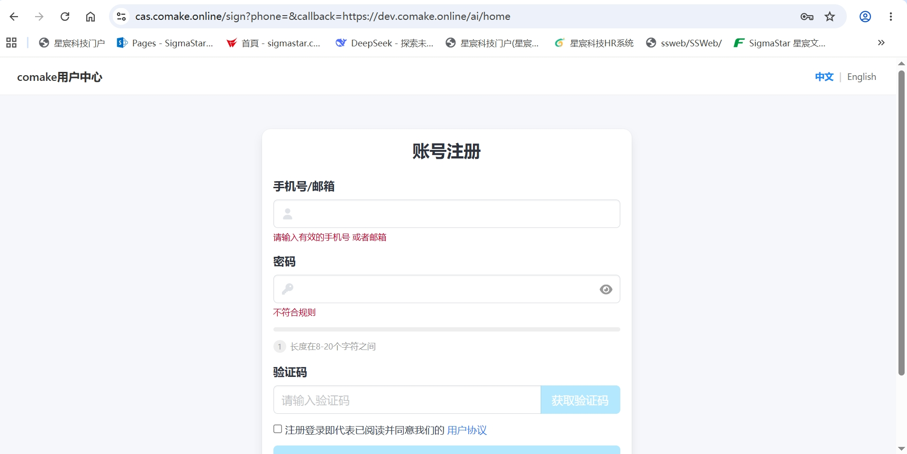
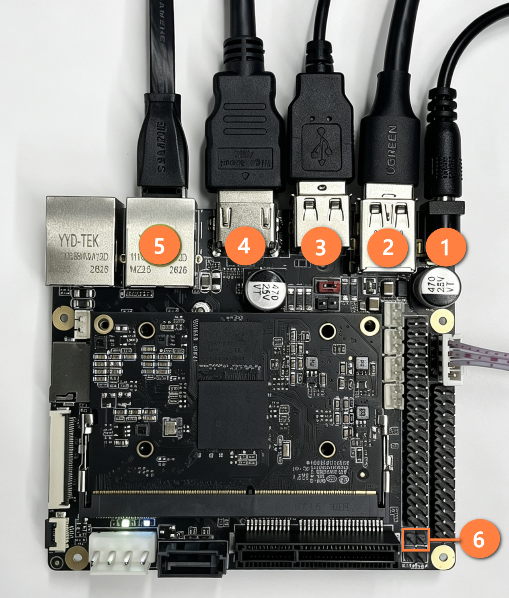
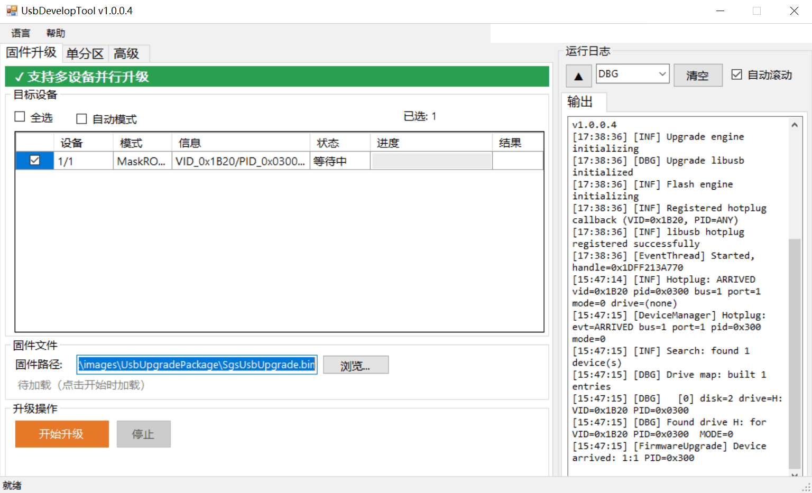

# Comake Pi D3 快速上手指南

## 1. 认识 Comake Pi D3

### 1.1 Comake 平台简介

[Comake](https://www.comake.online) 是一站式端边侧 AI 开发服务平台，提供从选型到量产的全链路支持。"Comake Pi" 是 Comake 自研的物理 AI 开发板系列，覆盖从轻智能 AIoT（D1，1T 算力）到机器人大脑（D8，300T 算力）的全场景需求。

### 1.2 Comake Pi D3 是什么

Comake Pi D3 是一块**面向端边侧 AI 应用的视频边缘计算开发板**。其核心计算模块搭载 SigmaStar SCM8003G 主控芯片，采用 260-Pin SO-DIMM 金手指标准封装。核心规格如下：

| 项目 | 规格 |
|------|------|
| SoC | SCM8003G，6 核 ARM Cortex-A55，最高 1.8GHz |
| AI 引擎 | 8 TOPS IPU（支持 INT4/8/16、FP16/BF16） |
| 视频分析 | IVE 智能视频引擎（30+ 算子） |
| 安全引擎 | AES/RSA/SM2~4 国密、Secure Boot、TrustZone |
| 内存 | LPDDR4X，2GB / 4GB（可选配置），最高 3200 Mbps |
| 存储 | 64GB eMMC 5.0 |
| 视频解码 | H.265/H.264，最大 2 路 8K@30fps；JPEG 4K@25fps × 2 |
| 视频编码 | H.264 1080P@30fps；JPEG 4K@30fps |
| 显示 | HDMI 4K@30 + MIPI DSI 2560×1600@60 + VGA 1920×1200@60，支持双屏异显 |
| 音频 | 立体声 ADC + DAC；I2S 8 通道 + DMIC 8 通道 |
| 网络 | 双路千兆网（底板需外接 PHY） |
| USB | 1× USB 3.0 DRD + 4× USB 2.0 |
| PCIe | 双路 PCIe 2.0，每路 2-Lane，5 GT/s |
| SATA | 双路 SATA 3.0，6 Gbps |
| 尺寸 | 70.0mm × 45.0mm，典型功耗 ≤ 7W |

### 1.3 开发板接口


---

## 2. 准备工作

### 2.1 安装 Docker

```bash
# Step 1: 安装依赖
sudo apt-get update && sudo apt-get install -y qemu-user-static binfmt-support docker.io

# Step 2: 验证 aarch64 跨架构支持
update-binfmts --display | grep "aarch64"

# Step 3: 配置 Docker 用户权限（root 用户可跳过）
sudo usermod -aG docker $USER
# 执行后需重新登录或执行 newgrp docker 使配置生效
```

### 2.2 注册 Comake 账号并获取下载凭证

Git Web 平台不提供独立的账号注册功能，所有用户需通过 Comake 社区完成注册。

**Step 1：注册 Comake 社区账号**

1. 访问 **https://www.comake.online**，进入 Comake 社区首页

    

2. 点击页面右上角的「**登录**」按钮，进入登录页面

    

3. 在登录页面点击「**立即注册**」，进入账号注册页面

    

4. 按要求填写注册信息，完成注册
5. 注册成功后，使用该账号登录 Comake 社区

> 已拥有 Comake 社区账号的用户可跳过此步骤，直接登录。

**Step 2：获取下载凭据**

1. 登录 Comake 社区后，进入「**个人中心**」→「**HTTP 凭据**」

    

2. 仔细阅读「**开发者授权协议**」，勾选同意后点击「**获取下载凭据**」

    

凭据信息说明：

| 凭据项 | 说明 |
|--------|------|
| 用户名 | Comake 社区注册邮箱 |
| 密码 | Comake 社区账户密码 |
| Token | HTTP 凭据页面生成的凭据令牌，用于 `~/.netrc` 自动认证配置 |

### 2.3 配置下载凭据

通过配置 `~/.netrc` 文件，让 Git 自动使用凭据进行认证，无需每次手动输入用户名和密码。

```bash
# 编辑 ~/.netrc，写入以下内容：
# machine git.sigmastar.com.cn login <用户名> password <Token>
vi ~/.netrc
```

示例：

```
machine git.sigmastar.com.cn login user@example.com password abc123def456
```

保存后设置权限（保护凭据安全）：

```bash
chmod 600 ~/.netrc
```

### 2.4 安装 repo 工具

```bash
# 从清华镜像下载 repo 工具
sudo wget https://mirrors.tuna.tsinghua.edu.cn/git/git-repo -O /usr/bin/repo
sudo chmod a+x /usr/bin/repo
```

---

## 3. 下载 SDK

### 3.1 克隆下载脚本

```bash
git clone https://git.sigmastar.com.cn:9090/sigmastar/download_scripts.git
cd download_scripts
```

### 3.2 Debian SDK（推荐新手）

Debian SDK 提供完整的 Ubuntu 桌面体验，适合新手入门、桌面交互和多媒体播放场景。

**命令速查表：**

| 命令 | 说明 |
|------|------|
| `./D3_debian_setup.sh docker` | 下载 Docker 镜像 |
| `./D3_debian_setup.sh sdk-toolchains` | 下载交叉编译工具链 |
| `./D3_debian_setup.sh sdk` | 下载最新版本 SDK 源码 |
| `./D3_debian_setup.sh sdk <version>` | 下载指定版本 SDK 源码 |
| `./D3_debian_setup.sh tools` | 下载全部工具 |
| `./D3_debian_setup.sh tools <tool_name>` | 下载单个工具 |
| `./D3_debian_setup.sh model-zoo` | 下载算法模型库 |
| `./D3_debian_setup.sh docs` | 下载最新版本文档 |
| `./D3_debian_setup.sh docs <version>` | 下载指定版本文档 |
| `./D3_debian_setup.sh hw-ref-design` | 下载硬件参考设计资料 |
| `./D3_debian_setup.sh list-version` | 查看可用版本号 |
| `./D3_debian_setup.sh list-tools` | 查看可用工具列表 |
| `./D3_debian_setup.sh all` | 一键下载全部资源 |
| `./D3_debian_setup.sh build-rootfs` | 构建 Ubuntu 根文件系统 |
| `./D3_debian_setup.sh build-image` | 编译最终系统镜像 |

**快速上手：**

```bash
# 一键下载所有资源（Docker 镜像、工具链、SDK、工具集等）
./D3_debian_setup.sh all
```

执行 `all` 后的目录结构：

```
.
├── D3_debian_setup.sh
├── docs/                # 文档
├── hw-ref-design/       # 硬件参考设计
├── model-zoo/           # 算法模型库
├── SourceCode/          # SDK 源码（详见第 4 章）
│   ├── boot/
│   ├── kernel/
│   ├── optee/
│   ├── project/
│   └── sdk/
└── tools/               # SDK 工具集
    ├── BWLATool/
    ├── CalibrationTool/
    ├── FlashTool/
    ├── GenScalerTbl/
    ├── MakeBin/
    ├── PQTool/
    ├── SystemTool/
    ├── ToolChain/        # 交叉编译工具链
    ├── UsbDevelopTool/
    └── ...
```

### 3.3 Linux SDK

Linux SDK 提供精简的 64-bit Linux 系统（无桌面），适合产品化部署、资源受限或不需要图形界面的场景。Linux SDK 还支持直接下载预编译的固件镜像，无需本地编译。

**命令速查表：**

| 命令 | 说明 |
|------|------|
| `./D3_linux_setup.sh docker` | 下载 Docker 镜像 |
| `./D3_linux_setup.sh sdk-toolchains` | 下载交叉编译工具链 |
| `./D3_linux_setup.sh sdk` | 下载最新版本 SDK 源码 |
| `./D3_linux_setup.sh sdk <version>` | 下载指定版本 SDK 源码 |
| `./D3_linux_setup.sh image` | 下载最新版本预编译固件镜像 |
| `./D3_linux_setup.sh image <version>` | 下载指定版本预编译固件镜像 |
| `./D3_linux_setup.sh tools` | 下载全部工具 |
| `./D3_linux_setup.sh tools <tool_name>` | 下载单个工具 |
| `./D3_linux_setup.sh model-zoo` | 下载算法模型库 |
| `./D3_linux_setup.sh docs` | 下载最新版本文档 |
| `./D3_linux_setup.sh docs <version>` | 下载指定版本文档 |
| `./D3_linux_setup.sh hw-ref-design` | 下载硬件参考设计资料 |
| `./D3_linux_setup.sh list-version` | 查看可用版本号 |
| `./D3_linux_setup.sh list-tools` | 查看可用工具列表 |
| `./D3_linux_setup.sh all` | 一键下载全部资源 |
| `./D3_linux_setup.sh build-image` | 编译 64-bit Linux 系统镜像 |

> **与 Debian SDK 的主要差异：** Linux SDK 多了 `image` 命令可直接下载预编译固件镜像，无需本地编译。

**快速上手：**

```bash
# 一键下载所有资源（Docker 镜像、工具链、SDK、工具集等）
./D3_linux_setup.sh all
```

执行 `all` 后的目录结构：

```
.
├── D3_linux_setup.sh
├── docs/                # 文档
├── hw-ref-design/       # 硬件参考设计
├── image/               # 预编译固件镜像（images.tar.gz）
├── model-zoo/           # 算法模型库
├── SourceCode/          # SDK 源码（详见第 4 章）
│   ├── boot/
│   ├── kernel/
│   ├── optee/
│   ├── project/
│   └── sdk/
└── tools/               # SDK 工具集
    ├── BWLATool/
    ├── CalibrationTool/
    ├── FlashTool/
    ├── GenScalerTbl/
    ├── MakeBin/
    ├── PQTool/
    ├── SystemTool/
    ├── ToolChain/        # 交叉编译工具链
    ├── UsbDevelopTool/
    └── ...
```

---

## 4. SDK 目录结构

下载完成后的 `SourceCode/` 目录结构如下：

```
SourceCode/
├── boot/                # U-Boot 引导程序
│   ├── arch/            #   架构相关代码（ARM）
│   ├── board/           #   板级支持（SigmaStar 平台）
│   ├── cmd/             #   U-Boot 命令实现
│   ├── configs/         #   板级默认配置文件
│   ├── drivers/         #   外设驱动（USB、MMC、NET 等）
│   ├── dts/             #   设备树源文件
│   ├── include/         #   头文件
│   ├── tools/           #   辅助工具
│   └── Makefile         #   U-Boot 编译入口
│
├── kernel/              # Linux 内核
│   ├── arch/arm64/      #   ARM64 架构代码（设备树在此）
│   ├── drivers/         #   内核驱动
│   ├── include/         #   内核头文件
│   ├── net/             #   网络协议栈
│   ├── sound/           #   音频子系统
│   └── Makefile         #   内核编译入口
│
├── project/             # 编译工程入口
│   ├── board/           #   板级配置（mhera/D3 等）
│   ├── configs/         #   defconfig 配置文件
│   ├── image/           #   镜像打包脚本与输出
│   ├── kbuild/          #   内核编译集成
│   ├── release/         #   发布输出
│   ├── tools/           #   工程辅助工具
│   └── makefile         #   顶层 Makefile（编译入口）
│
├── sdk/                 # 核心媒体 SDK
│   ├── driver/          #   多媒体驱动
│   ├── linux/           #   用户空间库
│   ├── vendor/          #   第三方组件（ffmpeg、gstreamer 等）
│   └── verify/          #   示例代码与测试程序
│       └── sample_code/ #   demo 代码（LLM/VLM、DLA 等）
│
└── optee/               # OP-TEE 安全执行环境
    ├── optee_os/        #   可信 OS 内核
    ├── optee_client/    #   客户端库
    ├── optee_examples/  #   示例 TA 应用
    └── optee_test/      #   测试套件
```

---

## 5. 编译固件

下载完成后，使用脚本一键编译：

### 5.1 Debian SDK

```bash
# 构建 Ubuntu 根文件系统
./D3_debian_setup.sh build-rootfs

# 编译最终系统镜像（含 USB 升级固件）
./D3_debian_setup.sh build-image
```

### 5.2 Linux SDK

```bash
# 编译 64-bit Linux 系统镜像
./D3_linux_setup.sh build-image
```

编译完成后，`SgsUsbUpgrade.bin` 生成在 `SourceCode/project/image/output/images/UsbUpgradePackage/`，用于下一步的[烧录运行](#6-烧录运行)。

---

## 6. 烧录运行

### 6.1 硬件接线



1. 开发板 CONV1 12V DC 电源接口接入 DC 12V 电源适配器。
2. 将双公头 USB 数据线一端接入开发板 CONU8 USB2.0 接口（黑色），另一端接入 PC。
3. 开发板任意 CON11 USB2.0 接口接入鼠标。
4. 将 HDMI 数据线一端接入开发板 CONH1 HDMI 接口，另一端接入显示屏。
5. 开发板 CONG1 RJ45 GE0 网口接入网线，确保开发板与 PC 连接至同一网段。

### 6.2 进入 USB 升级模式

根据 eMMC 当前状态，选择对应方式让开发板进入 USB 升级模式：

- **空片升级**：eMMC 处于出厂空白状态，或 U-Boot 等固件已被完全擦除。在 JPF6 USB BOOT 插上跳帽（硬件连接图标记 ⑥），开发板即强制进入 USB 启动模式。

- **非空片升级**：eMMC 上已有可运行的 U-Boot。

    1. 打开串口调试，使用 USB-TTL 串口转换板连接开发板 JPO1 DBG 接口（波特率 115200）。
    2. 开发板上电，进入 U-Boot，输入 `sgsusb` 进入 USB 升级模式。

    ```
    Sgs # sgsusb
    <USB>[UDC] PULL UP D+.
    <USB>[GADGET] UDC start
    SGS USB upgrade: no default storage (ctrl 0)
    Waiting for USB connection...
    <USB>[LINK] Suspend.
    <USB>[LINK] High speed device.
    <USB>[2][Enable] bulk out with maxpacket/fifo(512/1024)
    <USB>[1][Enable] bulk in with maxpacket/fifo(512/8192)
    ```

### 6.3 整包固件升级

打开 "UsbDevelopToolUI.exe" --> "固件升级"，选中 `SourceCode/project/image/output/images/UsbUpgradePackage` 下生成的 `SgsUsbUpgrade.bin`，点击 "开始升级"。



### 6.4 单分区升级

1. 打开 "UsbDevelopToolUI.exe" --> "高级"，解包原固件。
2. 替换 UsbDevToolImage 目录中的分区文件。
3. 切换到工具的 "单分区" 界面，选择设备，浏览解包目录下的 package.ini，勾选要升级的分区，再点击 "开始升级"。

### 6.5 验证

**Debian SDK：** 升级完成后，显示器将显示 Ubuntu 桌面登录界面。

| 用户名 | 密码 |
|--------|------|
| ubuntu | ubuntu |
| root   | 123456 |

**Linux SDK：** 升级完成后，通过串口终端（波特率 115200）连接开发板，能正常进入终端即可。

> 至此，你已经成功跑通了 Comake Pi D3 的完整开发流程。

---

## 7. 参考资料

- [Sigmastar Git Web 平台使用指南](Sigmastar_GitWeb_Guide.md)
- 软件开发参考资料：执行 `./D3_debian_setup.sh docs` 或 `./D3_linux_setup.sh docs` 下载
- 硬件参考资料：执行 `./D3_debian_setup.sh hw-ref-design` 或 `./D3_linux_setup.sh hw-ref-design` 下载
