# Comake Pi D3 Quick Start Guide

## 1. Platform Overview

### 1.1 Comake

[Comake](https://www.comake.online) is a one-stop edge-side AI development service platform providing end-to-end support from selection to mass production. "Comake Pi" is Comake's self-developed physical AI development board series, covering the scenarios from lightweight smart AIoT (1 TOPS) to video edge computing (8 TOPS).

### 1.2 Git Web

[Git Web](https://git.sigmastar.com.cn:9090/user/login) is the code hosting platform provided externally by Sigmastar.

**Platform positioning:**

- **Code distribution**: Publishes SDKs, sample code, tools, and more for users to download and use.
- **Issue feedback**: Users can submit problems, suggestions, or technical inquiries through the issue feature.

**Account system:**

The [Git Web](https://git.sigmastar.com.cn:9090/user/login) platform's accounts are integrated with the Sigmastar Comake community (`https://www.comake.online`). Users must first register a Comake community account before they can log in to Git Web.

> [!NOTE]
> This platform is read-only for external users and **does not support creating personal repositories or directly committing code**.

### 1.3 Comake Pi D3

Comake Pi D3 is a **video edge computing development board designed for edge-side AI applications**. Its core compute module is built around the SigmaStar SCM8003G main control chip and uses the standard 260-Pin SO-DIMM gold-finger package. Detailed hardware specifications are listed below.

#### 1.3.1 Main Board Interface Module Diagram


#### 1.3.2 Base Board Interface Module Diagram


#### 1.3.3 Interface Overview

| Interface (Module) | Name | Specification | Purpose (Peripherals) |
| --- | --- | --- | --- |
| SCM8003G | Main SoC | Six-core ARM Cortex-A55, up to 1.8GHz | Provides core compute and control capability for the device, targeting edge-side AI/NVR applications |
| CXDB5CBAM-MA-B | DDR Memory | LPDDR4X, total capacity 4GB | Provides high-speed runtime memory for the SCM8003G SoC |
| JPO1 DBG | Debug UART Interface | 4-pin debug UART header, TTL level, baud rate 115200 | Standard debug serial port of the development board, communicates with the PC serial port for low-level firmware flashing, debugging, and logging (Dupont wires, USB-TTL serial converter, USB extension cable, Linux PC) |
| CONV1 12V DC | Power Connector | DC 12V power input | DC power input for the development board (DC 12V power adapter) |
| CONU8 USB2.0+USB3.0 | USB Interface | USB 2.0 port + USB 3.0 port | Used for firmware flashing and system upgrades over the fastboot protocol (USB male-to-male cable) |
| CON11 USB2.0*2 | USB Interface | Two USB 2.0 ports | Operates the desktop system and mounts USB drives (mouse, keyboard, USB drive) |
| CONH1 HDMI | HDMI Interface | HDMI Type-A output interface | High-definition multimedia output for connecting a monitor and displaying the Ubuntu desktop, supporting visual operation and UI debugging (HDMI cable, monitor) |
| CONG1 RJ45 GE0 | Gigabit Ethernet Port | RJ45 interface, supports 10 / 100 / 1000 Mbps | Connects to the network, supports network communication and remote debugging for high-speed data transfer (Ethernet cable) |
| CONG2 RJ45 GE1 | Gigabit Ethernet Port | RJ45 interface, supports 10 / 100 / 1000 Mbps | Connects to the network, supports network communication and remote debugging for high-speed data transfer (Ethernet cable) |
| J13 FAN CON | Fan Interface | PWM-controlled fan, default 5V, optionally 12V | Connects a cooling fan, regulating speed via PWM for heat dissipation (fan) |
| SDC2 TF Socket | TF Card Slot | Micro SD card slot | Inserts a TF card to expand storage and boot the system (TF card) |
| CON8 MIPI Panel | MIPI Interface | MIPI DSI output interface | Connects a MIPI panel to output the Ubuntu desktop (FPC flat cable, MIPI panel) |
| CON9 TP CON | Touch Interface | FPC touch interface, default left-side pin order | Connects a touch screen for touch input and UI interaction (FPC flat cable, touch screen) |
| J7 SATA PWR | SATA Power Interface | SATA hard drive power interface | Provides power to a SATA hard drive (SATA power cable) |
| CONS4 SATA | SATA Interface | Supports SATA gen3 | Connects a SATA hard drive for storage expansion (SATA hard drive) |
| CONP2 PCIE CON | PCIe Connector | PCIe gen2×2 | Connects PCIe devices for high-speed peripheral expansion (PCIe expansion card) |
| JPF6 USB BOOT | USB Boot Jumper | 2-pin USB boot jumper | Insert a jumper to force USB boot mode for blank-chip flashing or firmware recovery (jumper) |
| J1 RTC PWR | RTC Battery Jumper | 2-pin RTC power jumper | Connects an RTC battery to maintain the system clock after power loss (RTC battery) |
| JP2 30P Expansion Header | 30P Expansion Header | 30-pin expansion pin header | Routes signals such as GPIO for peripheral expansion (Dupont wires, expansion modules) |
| JP1 40P Expansion | 40P Expansion Header | 40-pin expansion pin header | Routes signals such as GPIO for peripheral expansion (Dupont wires, expansion modules) |
| JPF9 USB2.0 PWR | USB2.0 Power Jumper | USB2.0 VBUS power jumper for CONU8 | Insert a jumper when configured as HOST to power a Device (jumper) |
| JPF8 USB3.0 PWR | USB3.0 Power Jumper | USB3.0 VBUS power jumper for CONU8 | Insert a jumper when configured as HOST to power a Device (jumper) |
| CON10 SPK_R | Speaker Interface (Right Channel) | Analog audio output interface | Outputs the right-channel audio signal to drive a speaker (speaker) |
| CON4 SPK_L | Speaker Interface (Left Channel) | Analog audio output interface | Outputs the left-channel audio signal to drive a speaker (speaker) |
| CON24 MIC1 | Microphone Interface | Analog audio input interface | Captures audio signals input to the system for voice recording and communication (microphone) |
| CON23 MIC0 | Microphone Interface | Analog audio input interface | Captures audio signals input to the system for voice recording and communication (microphone) |
| J4 mSATA | mSATA Interface | mSATA drive interface | Connects an mSATA drive for storage expansion (mSATA drive) |
| CN1 M.2 B-KEY 2230 | M.2 B-Key Connector | PCIe 2.0×2 + USB 2.0 | Provides PCIe 2.0×2 for an NVMe SSD 2230 drive and one pair of USB 2.0 for a 4G module EM05-CN (NVMe SSD, 4G module) |
| JZ2 DMIC | DMIC Interface | 4-channel DMIC, supports up to 8 DMICs | Connects digital microphones for audio capture (DMIC) |
| JW1 IPEX | IPEX Connector | Wi-Fi antenna IPEX connector | Connects a Wi-Fi antenna (Wi-Fi antenna) |
| UW2 USB-Wifi | USB Wi-Fi Module Interface | Reserved USB Wi-Fi module, connects SSW105AT, USB P0 defaults to Type-A | Connects a USB Wi-Fi module for wireless networking (USB Wi-Fi module) |
| CN4 NANO-SIM CON | NANO-SIM Card Slot | NANO-SIM card slot | Inserts a SIM card for use with the M.2 4G module (SIM card) |

---

## 2. Preparation

### 2.1 Install Docker

**Step 1: Install dependencies**

    sudo apt-get update && sudo apt-get install -y qemu-user-static binfmt-support docker.io

**Step 2: Verify aarch64 cross-architecture support**

    update-binfmts --display | grep "aarch64"

Expected output:

    qemu-aarch64 (enabled):
     interpreter = /usr/libexec/qemu-binfmt/aarch64-binfmt-P

If not enabled, run:

    sudo update-binfmts --enable

**Step 3: Configure Docker user permissions (root users can skip)**

Add the current user to the `docker` group to avoid needing `sudo` every time you run a `docker` command:

    sudo usermod -aG docker $USER

> **Note**: After running the above command, you need to log in again or run `newgrp docker` for the configuration to take effect.

### 2.2 Obtain Git Download Credentials

After registering an account on the [Comake community](https://www.comake.online), visit the [Comake User Center](https://www.comake.online/account) and note the following information for Git authentication:

- Email: Your Comake community registration email

    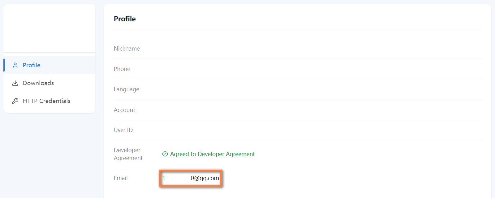

- Token: Generated by clicking the "Get Download Credentials" button on the "HTTP Credentials" page

    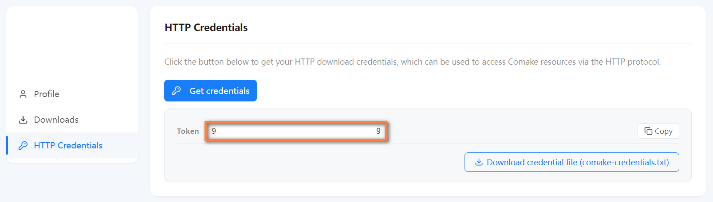

### 2.3 Configure the Git Environment

1. Write the Git download credentials into your local `.netrc` file (this lets Git authenticate automatically using the credentials, without entering a username and password each time):

        echo "machine git.sigmastar.com.cn login <email> password <Token>" >> ~/.netrc
        chmod 600 ~/.netrc

2. Install the `repo` multi-repository management tool (the download script uses it to fetch the SDK source code):

        sudo wget https://mirrors.tuna.tsinghua.edu.cn/git/git-repo -O /usr/bin/repo
        sudo chmod a+x /usr/bin/repo

3. Set Git global username and email:

        git config --global user.name "your username"
        git config --global user.email "your email"

---

## 3. Download the SDK

### 3.1 Clone the Download Script

```bash
git clone https://git.sigmastar.com.cn:9090/sigmastar/download_scripts.git
cd download_scripts
```

### 3.2 Debian SDK (Recommended for Beginners)


The Debian SDK provides a complete Ubuntu desktop experience, suitable for beginners, desktop interaction, and multimedia playback scenarios.

**Quick start:**

```bash
# One-click download of all resources (Docker image, toolchain, SDK, toolset, etc.)
bash D3_debian_setup.sh all
```

Directory structure after running `all`:

```
.
├── D3_debian_setup.sh
├── docker_versions.yaml
├── docs/                # Documentation
├── hw_ref_design/       # Hardware reference design
├── sgs_model_zoo/       # Algorithm model library
├── SourceCode/          # SDK source code (see Chapter 4)
│   ├── boot/
│   ├── kernel/
│   ├── optee/
│   ├── project/
│   └── sdk/
└── tools/               # SDK toolset
    ├── BWLATool/
    ├── CalibrationTool/
    ├── FlashTool/
    ├── GenScalerTbl/
    ├── MakeBin/
    ├── PQTool/
    ├── SystemTool/
    ├── ToolChain/        # Cross-compilation toolchain
    ├── UsbDevelopTool/
    └── ...
```

**Command reference:**

| Command | Description |
|---------|-------------|
| `bash D3_debian_setup.sh list_version` | View available version numbers |
| `bash D3_debian_setup.sh all` | One-click download of all resources for the latest version |
| `bash D3_debian_setup.sh all <version>` | One-click download of all resources for a specified version |
| `bash D3_debian_setup.sh docker` | Download the latest Docker image |
| `bash D3_debian_setup.sh docker <version>` | Download the Docker image for a specified version |
| `bash D3_debian_setup.sh sdk_toolchains` | Download the cross-compilation toolchain |
| `bash D3_debian_setup.sh sdk` | Download the latest SDK source code |
| `bash D3_debian_setup.sh sdk <version>` | Download the SDK source code for a specified version |
| `bash D3_debian_setup.sh list_tools` | View the list of available tools |
| `bash D3_debian_setup.sh tools` | Download all tools |
| `bash D3_debian_setup.sh tools <tool_name>` | Download a single tool |
| `bash D3_debian_setup.sh model_zoo` | Download the latest algorithm model library |
| `bash D3_debian_setup.sh model_zoo <version>` | Download the algorithm model library for a specified version |
| `bash D3_debian_setup.sh docs` | Download the latest documentation |
| `bash D3_debian_setup.sh docs <version>` | Download the documentation for a specified version |
| `bash D3_debian_setup.sh hw_ref_design` | Download hardware reference design materials |
| `bash D3_debian_setup.sh build_rootfs` | Build the latest Ubuntu root filesystem |
| `bash D3_debian_setup.sh build_rootfs <version>` | Build the Ubuntu root filesystem for a specified version |
| `bash D3_debian_setup.sh build_image` | Build the latest system image |
| `bash D3_debian_setup.sh build_image <version>` | Build the system image for a specified version |

### 3.3 Linux SDK

The Linux SDK provides a streamlined 64-bit Linux system (no desktop), suitable for productization deployment, resource-constrained scenarios, or cases where a graphical interface is not needed. The Linux SDK also supports directly downloading precompiled firmware images, with no local compilation required.

**Quick start:**

```bash
# One-click download of all resources (Docker image, toolchain, SDK, toolset, etc.)
bash D3_linux_setup.sh all
```

Directory structure after running `all`:

```
.
├── D3_linux_setup.sh
├── docker_versions.yaml
├── docs/                # Documentation
├── hw_ref_design/       # Hardware reference design
├── image/               # Precompiled firmware image (images.tar.gz)
├── sgs_model_zoo/       # Algorithm model library
├── SourceCode/          # SDK source code (see Chapter 4)
│   ├── boot/
│   ├── kernel/
│   ├── optee/
│   ├── project/
│   └── sdk/
└── tools/               # SDK toolset
    ├── BWLATool/
    ├── CalibrationTool/
    ├── FlashTool/
    ├── GenScalerTbl/
    ├── MakeBin/
    ├── PQTool/
    ├── SystemTool/
    ├── ToolChain/        # Cross-compilation toolchain
    ├── UsbDevelopTool/
    └── ...
```

**Command reference:**

| Command | Description |
|---------|-------------|
| `bash D3_linux_setup.sh list_version` | View available version numbers |
| `bash D3_linux_setup.sh all` | One-click download of all resources for the latest version |
| `bash D3_linux_setup.sh all <version>` | One-click download of all resources for a specified version |
| `bash D3_linux_setup.sh docker` | Download the latest Docker image |
| `bash D3_linux_setup.sh docker <version>` | Download the Docker image for a specified version |
| `bash D3_linux_setup.sh sdk_toolchains` | Download the cross-compilation toolchain |
| `bash D3_linux_setup.sh sdk` | Download the latest SDK source code |
| `bash D3_linux_setup.sh sdk <version>` | Download the SDK source code for a specified version |
| `bash D3_linux_setup.sh image` | Download the latest firmware image for flashing |
| `bash D3_linux_setup.sh image <version>` | Download the firmware image for a specified version |
| `bash D3_linux_setup.sh list_tools` | View the list of available tools |
| `bash D3_linux_setup.sh tools` | Download all tools |
| `bash D3_linux_setup.sh tools <tool_name>` | Download a single tool |
| `bash D3_linux_setup.sh model_zoo` | Download the latest algorithm model library |
| `bash D3_linux_setup.sh model_zoo <version>` | Download the algorithm model library for a specified version |
| `bash D3_linux_setup.sh docs` | Download the latest documentation |
| `bash D3_linux_setup.sh docs <version>` | Download the documentation for a specified version |
| `bash D3_linux_setup.sh hw_ref_design` | Download hardware reference design materials |
| `bash D3_linux_setup.sh build_image` | Build the latest system image |
| `bash D3_linux_setup.sh build_image <version>` | Build the system image for a specified version |

> **Main difference from the Debian SDK:** The Linux SDK adds an `image` command that lets you directly download a precompiled firmware image, with no local compilation required.

---

## 4. SDK Directory Structure

After the download completes, the `SourceCode/` directory structure is as follows:

```
SourceCode/
├── boot/                # U-Boot bootloader
│   ├── arch/            #   Architecture-related code (ARM)
│   ├── board/           #   Board support (SigmaStar platform)
│   ├── cmd/             #   U-Boot command implementations
│   ├── configs/         #   Board default configuration files
│   ├── drivers/         #   Peripheral drivers (USB, MMC, NET, etc.)
│   ├── dts/             #   Device tree source files
│   ├── include/         #   Header files
│   ├── tools/           #   Helper tools
│   └── Makefile         #   U-Boot build entry point
│
├── kernel/              # Linux kernel
│   ├── arch/arm64/      #   ARM64 architecture code (device tree here)
│   ├── drivers/         #   Kernel drivers
│   ├── include/         #   Kernel header files
│   ├── net/             #   Network protocol stack
│   ├── sound/           #   Audio subsystem
│   └── Makefile         #   Kernel build entry point
│
├── project/             # Build project entry point
│   ├── board/           #   Board configuration
│   ├── configs/         #   defconfig configuration files
│   ├── image/           #   Image packaging scripts and output
│   ├── kbuild/          #   Kernel build integration
│   ├── release/         #   Release output
│   ├── tools/           #   Project helper tools
│   └── makefile         #   Top-level Makefile (build entry point)
│
├── sdk/                 # Core media SDK
│   ├── driver/          #   Multimedia drivers
│   ├── linux/           #   User-space libraries
│   ├── vendor/          #   Third-party components (ffmpeg, gstreamer, etc.)
│   └── verify/          #   Sample code and test programs
│       └── sample_code/ #   Demo code (LLM/VLM, DLA, etc.)
│
└── optee/               # OP-TEE secure execution environment
    ├── optee_os/        #   Trusted OS kernel
    ├── optee_client/    #   Client library
    ├── optee_examples/  #   Sample TA applications
    └── optee_test/      #   Test suite
```

---

## 5. Building Firmware

After the download completes, use the script to build with one click:

### 5.1 Debian SDK

```bash
# Build the Ubuntu root filesystem
bash D3_debian_setup.sh build_rootfs

# Build the 64-bit Ubuntu system image
bash D3_debian_setup.sh build_image
```

The `SgsUsbUpgrade.bin` generated in the `SourceCode/project/image/output/images/UsbUpgradePackage` directory is the USB upgrade firmware. See [Firmware Upgrade](#6-firmware-upgrade) for the upgrade method.

### 5.2 Linux SDK

```bash
# Build the 64-bit Linux system image
bash D3_linux_setup.sh build_image
```

The `SgsUsbUpgrade.bin` generated in the `SourceCode/project/image/output/images/UsbUpgradePackage` directory is the USB upgrade firmware. See [Firmware Upgrade](#6-firmware-upgrade) for the upgrade method.

---

## 6. Firmware Upgrade

### 6.1 Hardware Wiring


1. Connect the board's CONV1 12V DC power connector to a DC 12V power adapter.
2. Connect one end of a dual-male USB cable to the board's CONU8 USB 2.0 port (black), and the other end to the PC.
3. Connect a mouse to any CON11 USB 2.0 port on the board.
4. Connect one end of an HDMI cable to the board's CONH1 HDMI port, and the other end to a display.
5. Connect a network cable to the board's CONG1 RJ45 GE0 network port, making sure the board and the PC are connected to the same subnet.

### 6.2 Serial Connection <a id=serial></a>

The serial port is the most basic debugging method for embedded development. It can be used when there is no network or when the system has not yet booted. The example below uses MobaXterm:

1. Connect the development board's JPO1 DBG interface to the PC through Dupont wires, a USB-TTL serial converter, and a USB extension cable in sequence.

    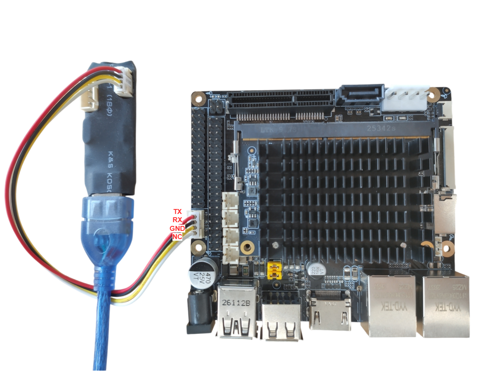

2. Open MobaXterm, click Session and then Serial. Choose the Serial Port according to the Device Manager (e.g., COM4) and set Speed (bps) to 115200. Click OK to open the serial connection.

    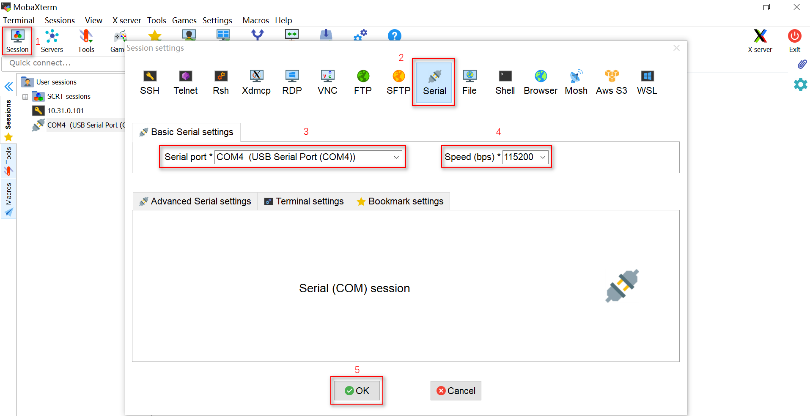

### 6.3 Enter USB Upgrade Mode

Depending on the current state of the eMMC, choose the corresponding method to put the board into USB upgrade mode:

- **Blank chip upgrade**: The eMMC is in its factory-blank state, or firmware such as U-Boot has been completely erased. The board is in USB upgrade mode by default; simply plug the USB cable into the CONU8 USB3.0 port and it will be recognized for upgrade.

- **Non-blank chip upgrade**: A runnable U-Boot already exists on the eMMC.

    1. Open a serial console and use a USB-TTL serial adapter board to connect to the board's JPO1 DBG port (baud rate 115200).
    2. Power on the board, enter U-Boot, and type `sgsusb` to enter USB upgrade mode.

            Sgs # sgsusb
            <USB>[UDC] PULL UP D+.
            <USB>[GADGET] UDC start
            SGS USB upgrade: no default storage (ctrl 0)
            Waiting for USB connection...
            <USB>[LINK] Suspend.
            <USB>[LINK] High speed device.
            <USB>[2][Enable] bulk out with maxpacket/fifo(512/1024)
            <USB>[1][Enable] bulk in with maxpacket/fifo(512/8192)

- **Forced upgrade**: Put a jumper cap on the JPF6 USB BOOT header (marked ⑥ in the hardware connection diagram), and the board will be forced into USB boot mode. This can be used for forced upgrade and recovery in abnormal states. After the upgrade, remove the jumper cap before normal use.

### 6.3 Full Firmware Package Upgrade

Open "UsbDevelopToolUI.exe" --> "Firmware Upgrade", select the `SgsUsbUpgrade.bin` generated under `SourceCode/project/image/output/images/UsbUpgradePackage`, and click "Start Upgrade".

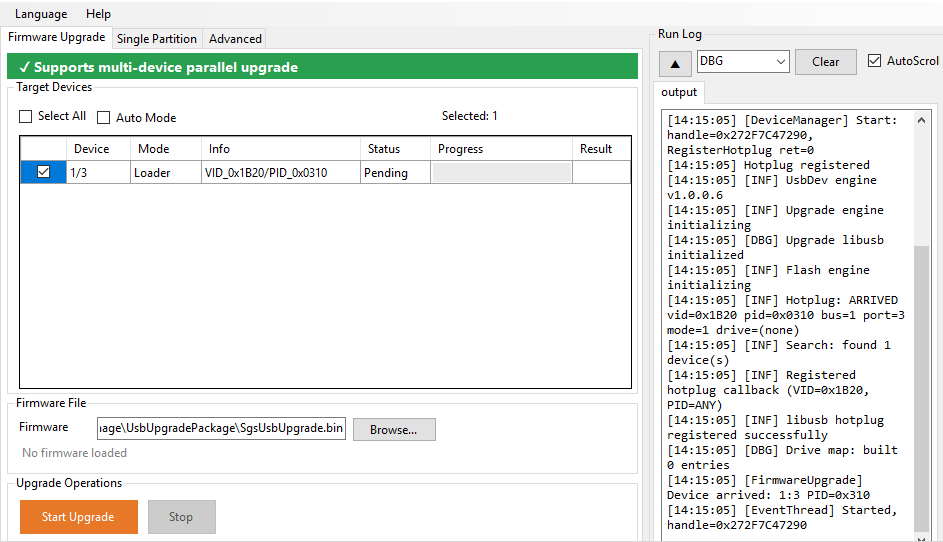

### 6.4 Single-Partition Upgrade

1. Open "UsbDevelopToolUI.exe" --> "Advanced" and unpack the original firmware.

    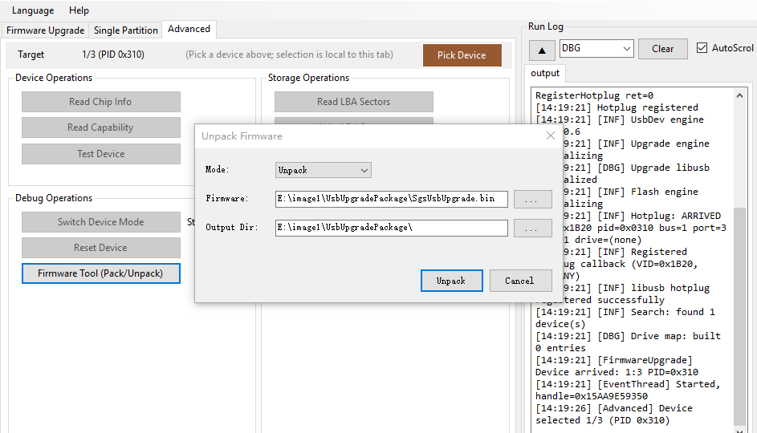

2. Replace the partition files in the UsbDevToolImage directory.
3. Switch to the tool's "Single Partition" interface, select the device, browse to package.ini under the unpacked directory, check the partitions you want to upgrade, and then click "Start Upgrade".

    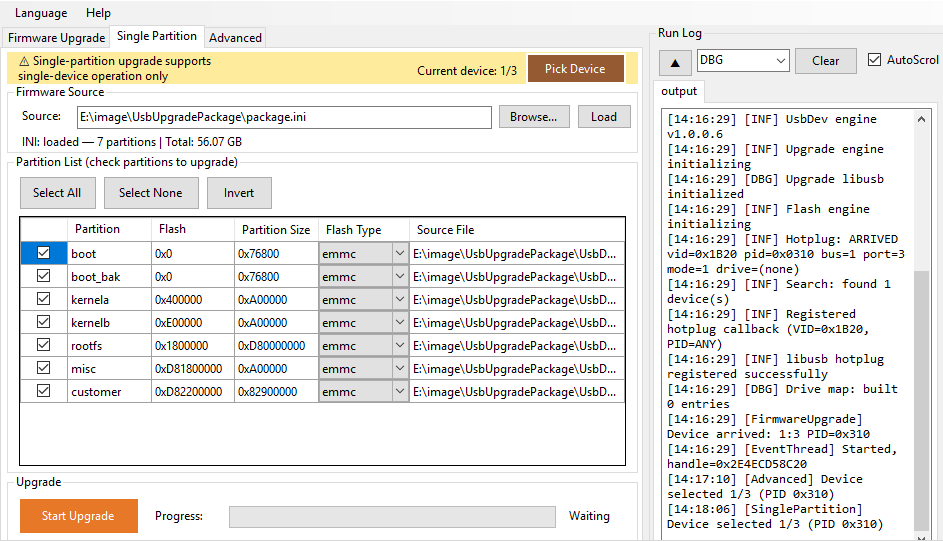

### 6.5 Verification

**Debian SDK:** After the upgrade completes, the display will show the Ubuntu desktop login screen.

| Username | Password |
|----------|----------|
| ubuntu | ubuntu |
| root   | 123456 |

**Linux SDK:** After the upgrade completes, connect to the board via a serial terminal (baud rate 115200) and confirm that you can reach the terminal normally.

> At this point, you have successfully run through the complete development workflow of the Comake Pi D3.

---

## 7. Git Web Platform Usage Guide

### 7.1 Log In to Git Web

1. Open a browser and visit [Git Web](https://git.sigmastar.com.cn:9090/user/login)

2. Enter your login credentials

	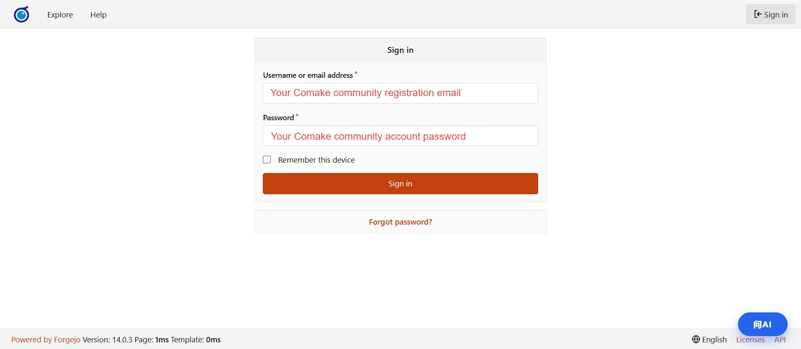

    - **Username**: The email used when registering your Comake account
    - **Password**: Your Comake community account password

3. Click the "Log In" button

> If login fails, please confirm that your Comake community account is activated and that the username and password are entered correctly.

### 7.2 Browse Repositories

After logging in, click "Explore" in the top navigation bar to view all publicly available code repositories. You can also search for a repository name directly using the search bar.

On the repository page you can view:

- File directory and contents
- Commit history
- Tags and Releases
- Branch list

### 7.3 Clone a Repository

On the repository page, click the "Copy URL" button to copy the HTTPS address:

```bash
git clone https://git.sigmastar.com.cn:9090/<namespace>/<repo-name>.git
```

After running it, enter your login credentials:

- **Username**: Your Comake community registration email
- **Password**: Your Comake community account password

### 7.4 Download an Archive

If you prefer not to use the Git command line, you can download the code archive directly: go to the repository page, click "...", then choose Download ZIP or Download TAR.GZ.

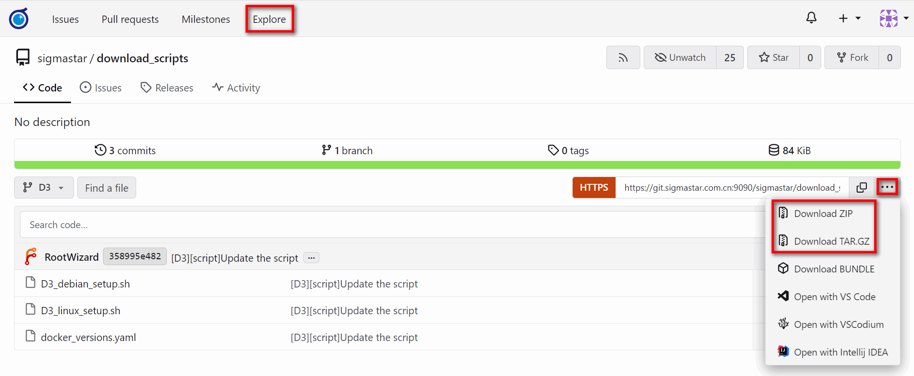

### 7.5 Update Local Code

When a repository on the platform is updated, run the following in your local repository directory:

```bash
git pull
```

### 7.6 Submit Feedback (Issues)

Issues are your channel for reporting problems to the Sigmastar technical team. You can submit via issues:

- **Bug reports**: Errors in code or documentation
- **Feature suggestions**: Features you'd like added or improved
- **Technical inquiries**: Technical problems encountered during use

#### 7.6.1 Create an Issue

1. Log in and go to the target repository
2. Click the "Issues" tab at the top
3. Click "New Issue"

    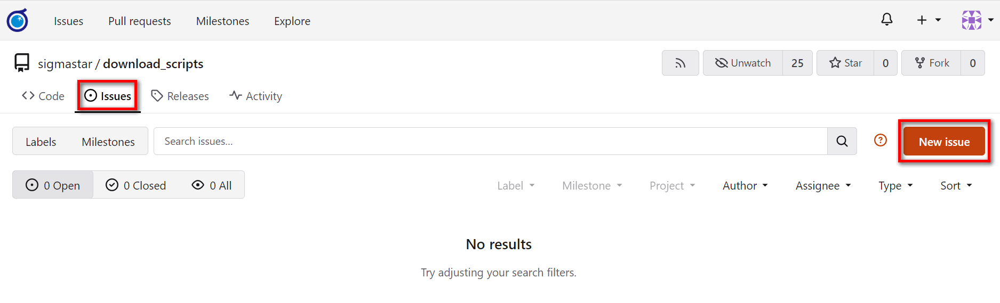

4. Fill in the issue

    - **Title**: A brief summary of the problem (e.g. "XXX sample fails to compile on Linux")
    - **Description**: A detailed description of the problem (refer to the template below)

5. Click the "Create Issue" confirmation button

    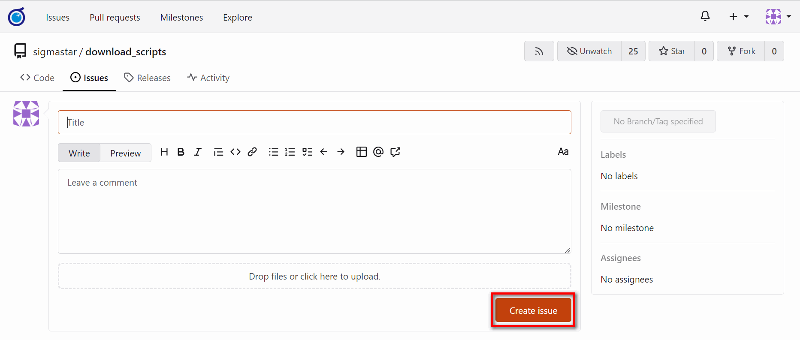

#### 7.6.2 Issue Description Template

We recommend filling in the following template so the technical team can quickly locate and address the problem:

```markdown
### Issue Type
<!-- Please choose: Bug report / Feature suggestion / Technical inquiry -->

### Environment Information
- Operating system:
- Code version / Tag:
- Toolchain version (if applicable):

### Problem Description
<!-- Please describe the problem you encountered in detail -->

### Steps to Reproduce (required for Bugs)
1.
2.
3.

### Expected Behavior
<!-- Describe the correct behavior you expect -->

### Actual Behavior
<!-- Describe the behavior you actually observed -->

### Additional Information
<!-- You may attach logs, screenshots, command-line output, etc. -->
```

#### 7.6.3 Tracking Issue Progress

After submitting an issue, you can:

- Communicate with Sigmastar technical staff via comments on the issue page
- When the issue is marked "Closed," it means the problem has been resolved
