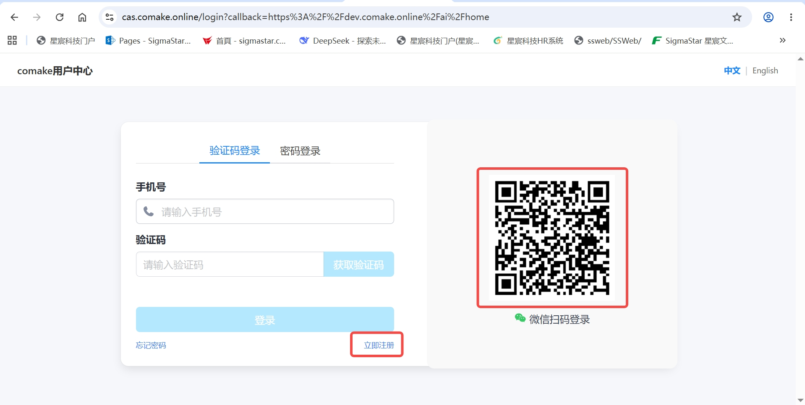
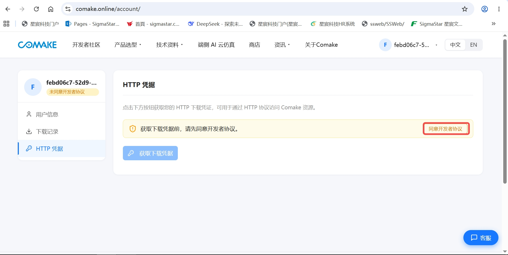
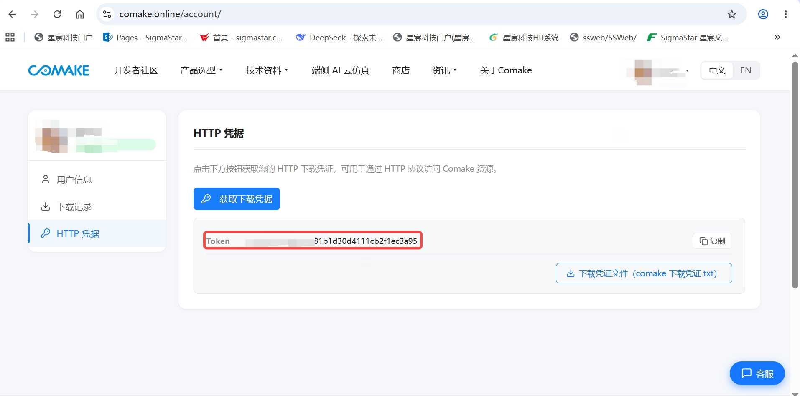
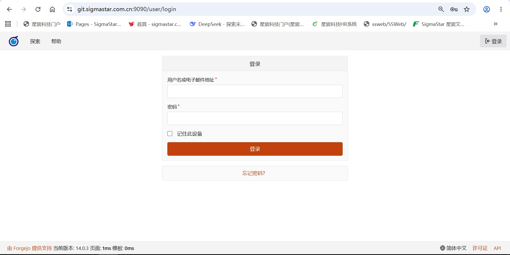
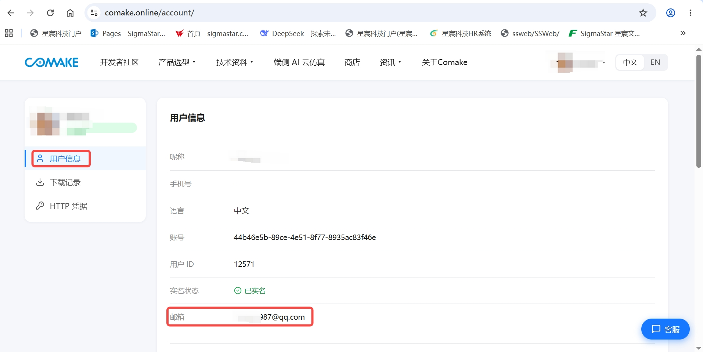
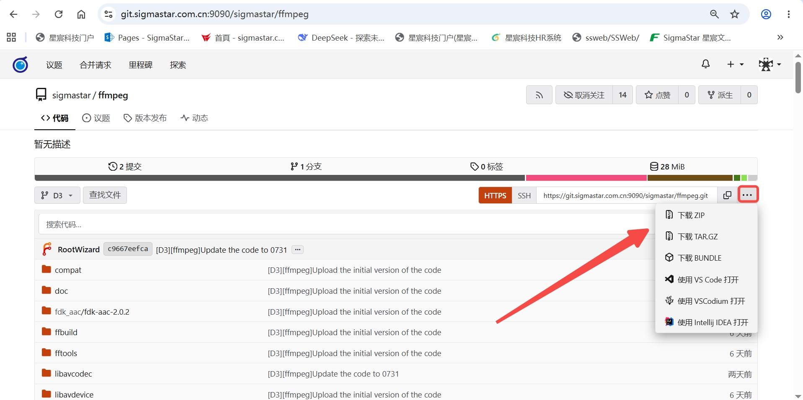
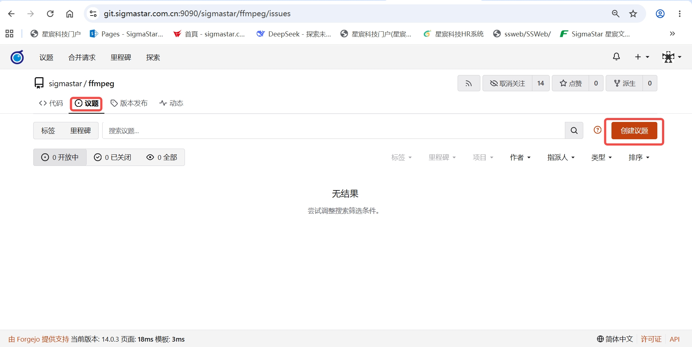
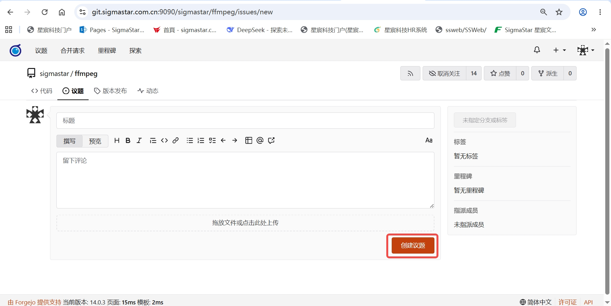

# Sigmastar Git Web 平台使用指南

> 访问地址：**https://git.sigmastar.com.cn:9090**

## 目录

- [1. 平台简介](#1-平台简介)
- [2. 账号注册（Comake 社区）](#2-账号注册comake-社区)
- [3. 登录 Git Web](#3-登录-git-web)
- [4. 获取代码](#4-获取代码)
- [5. 提交反馈（议题）](#5-提交反馈issue)

---

## 1. 平台简介

Sigmastar Git Web 是 Sigmastar 对外提供的代码托管平台。

**平台定位**：

- **代码分发**：对外发布 SDK、示例代码、工具等，供用户下载使用
- **议题反馈**：用户可通过议题功能提交问题、建议或技术咨询

**账号体系**：

Git Web 平台的账号与 Sigmastar Comake 社区（https://www.comake.online）打通，用户需先注册 Comake 社区账号后方可登录 Git Web。

> **注意**：本平台为对外只读平台，**不支持用户创建个人仓库或直接提交代码**。

---

## 2. 账号注册（Comake 社区）

Git Web 平台不提供独立的账号注册功能，所有用户需通过 Comake 社区完成注册。

### 2.1 注册 Comake 社区账号

1. 访问 **https://www.comake.online**，进入 Comake 社区首页


2. 点击页面右上角的「**登录**」按钮，进入登录页面



> 登录页面支持微信扫码登录，也可使用已注册的账号密码登录。

3. 在登录页面下方点击「**立即注册**」按钮，进入账号注册页面


4. 按要求填写注册信息，完成注册
5. 注册成功后，使用该账号登录 Comake 社区

> 已拥有 Comake 社区账号的用户可跳过此步骤，直接登录。

### 2.2 获取下载凭据

登录 Git Web 需要先获取 HTTP 下载凭据，获取方式如下：

1. 登录 Comake 社区后，进入「**个人中心**」
2. 选择「**HTTP 凭据**」



3. 仔细阅读「**开发者授权协议**」，勾选同意后方可继续操作

> **注意**：未勾选同意协议时，「获取下载凭据」按钮为灰色不可点击状态。

4. 点击「**获取下载凭据**」，系统将生成用于 Git Web 的访问凭据
   - 如果是首次获取且当前 Comake 账号尚未填写邮箱，系统会提示先填写邮箱地址，然后输入 Comake 账号密码进行二次确认，确认通过后即可获取凭据



凭据信息如下：

| 凭据项 | 说明 |
|--------|------|
| 用户名 | 你的 Comake 社区注册邮箱 |
| 密码 | Comake 社区账户密码（如通过微信扫码登录，则为微信密码） |
| Token | Comake 社区「HTTP 凭据」页面生成的凭据令牌，用于 `~/.netrc` 自动认证配置 |

> 请妥善保管凭据信息，后续登录 Git Web 和克隆代码时都需要使用。

---

## 3. 登录 Git Web

### 3.1 访问地址

在浏览器地址栏输入：

```
https://git.sigmastar.com.cn:9090/user/login
```

### 3.2 登录步骤

1. 打开浏览器，访问 `https://git.sigmastar.com.cn:9090/user/login`



2. 输入登录凭据：
   - **用户名**：Comake 社区注册邮箱
   - **密码**：Comake 社区账户密码



3. 点击「登录」按钮

> 如登录失败，请确认 Comake 社区账号已激活，且用户名和密码输入正确。

---

## 4. 获取代码

### 4.1 浏览仓库

登录后，点击顶部导航栏「探索」即可查看所有对外公开的代码仓库。你也可以通过搜索栏直接搜索仓库名称。

在仓库页面可以查看：
- 文件目录与内容
- 提交历史
- 版本标签（Tags）与发布（Releases）
- 分支列表

### 4.2 克隆仓库

在仓库页面，点击「复制网址」按钮，复制 HTTPS 地址：

```bash
git clone https://git.sigmastar.com.cn:9090/<namespace>/<repo-name>.git
```

执行后输入登录凭据：
- **用户名**：Comake 社区注册邮箱
- **密码**：Comake 社区账户密码（参见 [2.2 获取下载凭据](#22-获取下载凭据)）

> **提示**：为避免每次操作都需要输入用户名和密码，建议配置 HTTP 凭据自动认证，参见 [4.3 配置 HTTP 凭据自动认证](#43-配置-http-凭据自动认证)。

### 4.3 配置 HTTP 凭据自动认证

通过配置 `~/.netrc` 文件，可以让 Git 自动使用 Comake HTTP 凭据进行认证，无需每次手动输入用户名和密码。

1. 编辑 `~/.netrc` 文件（如不存在则新建）：
   ```bash
   vi ~/.netrc
   ```

2. 添加以下配置：
   ```
   machine git.sigmastar.com.cn login <username> password <key>
   ```

   其中：
   - `<username>`：Comake 社区注册邮箱
   - `<key>`：Comake 社区「HTTP 凭据」页面获取的 Token（参见 [2.2 获取下载凭据](#22-获取下载凭据)）

   示例：
   ```
   machine git.sigmastar.com.cn login user@example.com password abc123def456
   ```

3. 保存并设置权限（保护凭据安全）：
   ```bash
   chmod 600 ~/.netrc
   ```

配置完成后，后续使用 `git clone`、`git pull`、`git fetch` 等命令时将自动认证，无需再输入用户名和密码。

### 4.4 下载压缩包

如果不想使用 Git 命令行，可直接下载代码压缩包：进入仓库页面，点击「...」→ 选择 下载ZIP 或 下载TAR.GZ。



### 4.5 更新本地代码

当平台上的仓库有更新时，在本地仓库目录执行：

```bash
git pull
```

---

## 5. 提交反馈（议题）

议题是你向 Sigmastar 技术团队反馈问题的渠道。你可以通过议题提交：

- **Bug 报告**：代码或文档中的错误
- **功能建议**：希望新增或改进的功能
- **技术咨询**：使用过程中遇到的技术问题

### 5.1 创建议题

1. 登录后进入目标仓库
2. 点击顶部「议题」选项卡
3. 点击「创建议题」



4. 填写议题：
   - **标题**：简要概述问题（如 "XXX 示例在 Linux 环境编译失败"）
   - **描述**：详细说明问题（参考下方模板）
5. 点击「创建议题」



### 5.2 议题描述模板

建议按照以下模板填写，以便技术团队快速定位和处理：

```markdown
### 问题类型
<!-- 请选择：Bug 报告 / 功能建议 / 技术咨询 -->

### 环境信息
- 操作系统：
- 代码版本 / Tag：
- 工具链版本（如适用）：

### 问题描述
<!-- 请详细描述遇到的问题 -->

### 复现步骤（Bug 类必填）
1. 
2. 
3. 

### 期望行为
<!-- 描述你期望的正确行为 -->

### 实际行为
<!-- 描述实际观察到的行为 -->

### 附加信息
<!-- 可附上日志、截图、命令行输出等 -->
```

### 5.3 关注议题进度

提交议题后，你可以：
- 在议题页面与 Sigmastar 技术人员留言沟通
- 当议题被标记为「已关闭」时，表示问题已处理完成---
